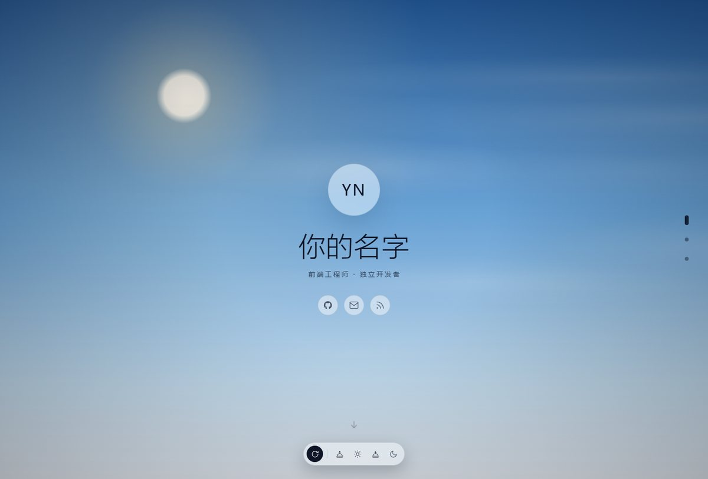
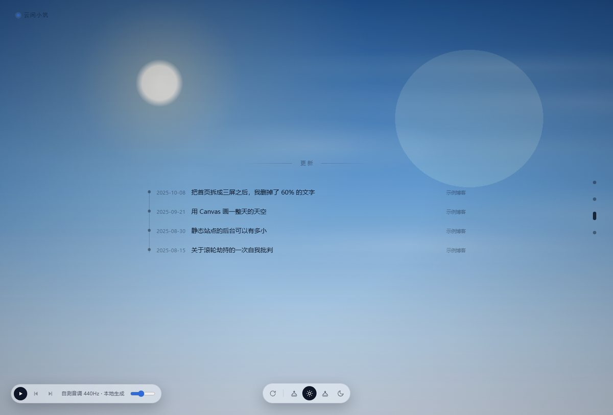
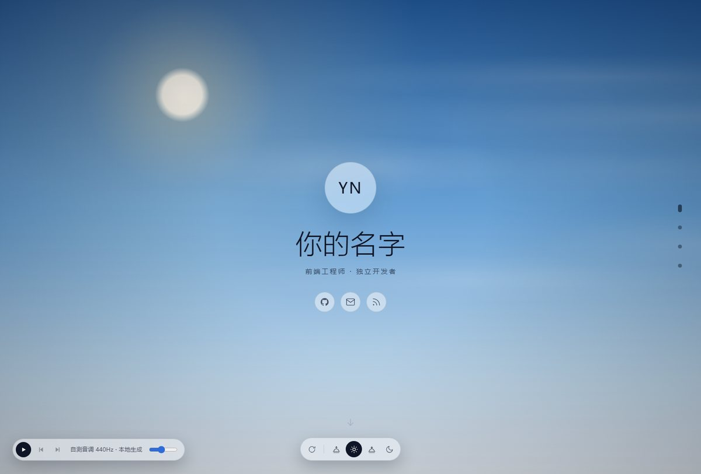
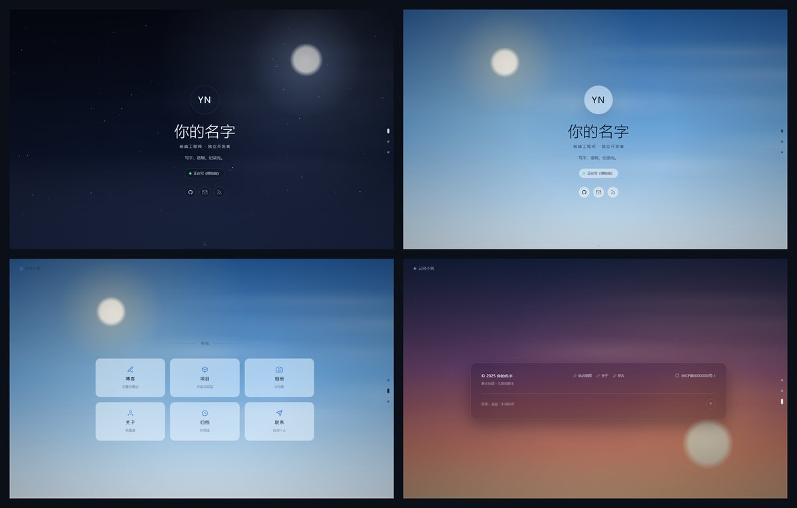
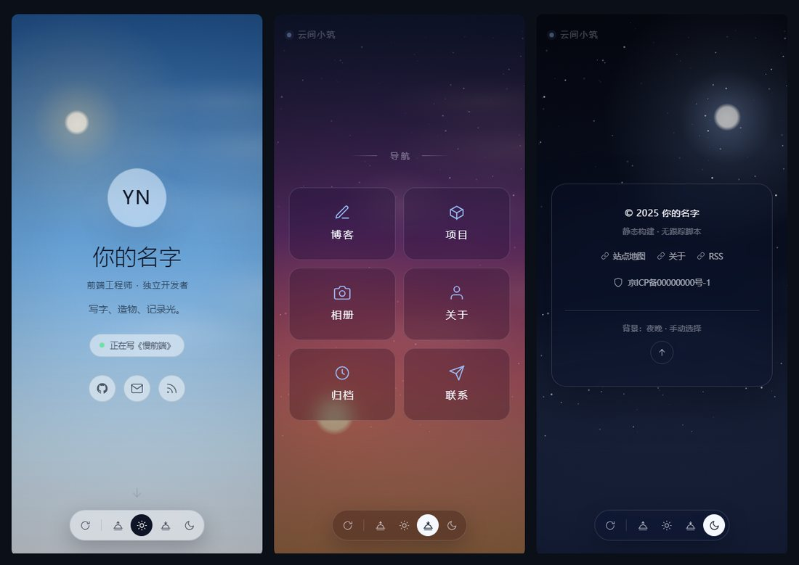
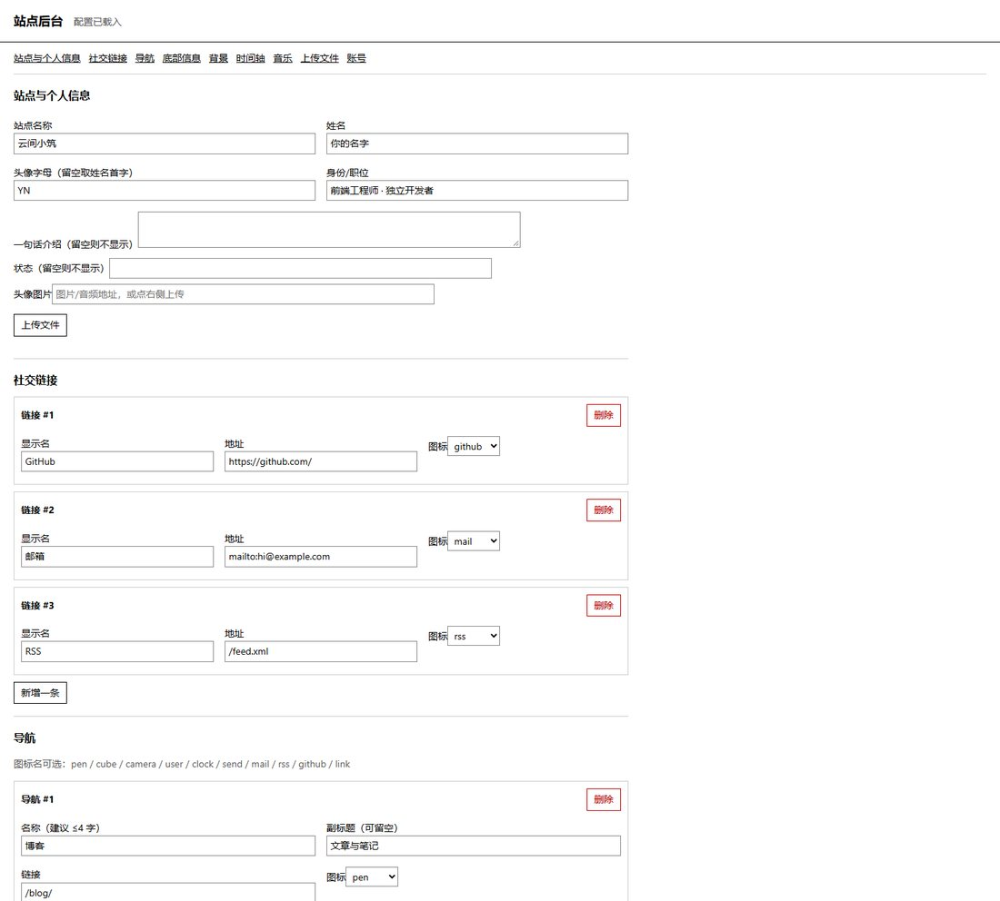
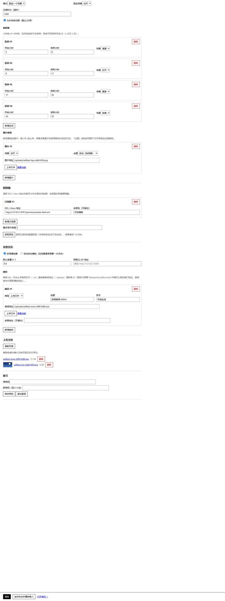

# 云间小筑 · 个人主页（首页兼导航页）+ 极简后台

[](https://www.python.org/)
[](#%E5%BF%AB%E9%80%9F%E5%BC%80%E5%A7%8B)
[](LICENSE)
[](#%E5%BF%AB%E9%80%9F%E5%BC%80%E5%A7%8B)

一个可以自己改内容的个人站点：**首页兼导航页**，下滑依次展开「个人信息 → 站点导航 → 最近更新 → 底部信息」；
背景按时间自动切换，也能手动切换，还支持换成自己的图片；
配一个只用 Python 标准库写的**零依赖后台**，用来改文案、传图片、配 RSS 时间轴和背景音乐。

整个项目没有构建步骤、没有 npm、没有 CDN 外链、不联网也能跑。



## 前排提示
本项目完全本人通过WishCoding完成，一定包含大量各种各样的问题亟待解决，但本人技术有限，创此仓库以记录本人学习过程

## 目录

- [这是什么](#这是什么)
- [功能特性](#功能特性)
- [效果预览](#效果预览)
- [快速开始](#快速开始)
- [后台使用](#后台使用)
- [配置说明](#配置说明)
- [目录结构](#目录结构)
- [HTTP 接口](#http-接口)
- [部署](#部署)
- [安全须知](#安全须知)
- [常见问题](#常见问题)
- [开发与自测](#开发与自测)
- [设计文档](#设计文档)
- [许可证](#许可证)

## 这是什么

给「个人主页 + 博客入口」这种形态的站点准备的一套首页方案，外加一个够用就好的后台。

- **首页**：静态 HTML/CSS/JS，四屏分屏滚动，视觉极简，文字密度被刻意压到很低（实测各屏文字覆盖面积 0.4%~2.9%，见[设计文档](docs/DESIGN.md)）。
- **后台**：`server.py` 单文件，标准库实现。同时兼任站点托管、配置读写、文件上传、RSS 抓取代理和音乐地址代理。
- **可分离**：不想用后台也没关系，删掉 `server.py` 就是一套纯静态站（图片背景与音乐直链仍可用，上传/时间轴/网易云不可用）。

## 功能特性

| | 说明 |
| --- | --- |
| 分屏滚动（3 或 4 屏） | 滚轮一次一屏、键盘 `↑↓/PgUp/PgDn/Space/Home/End`、触屏原生吸附；右侧指示点数量随屏数变化 |
| 时间感知背景 | 清晨/白天/黄昏/夜晚四套 Canvas 程序化场景，按本地时间自动切换；切换是数值插值不是硬换图 |
| 手动切换背景 | 底部胶囊：自动 / 清晨 / 白天 / 黄昏 / 夜晚，纯图标 |
| 自定义图片背景 | 按场景替换为图片，支持填 URL 或直接上传；可指定该场景用亮色还是暗色文字 |
| RSS 时间轴 | 服务端抓 RSS/Atom 生成「最近更新」屏；**一个源都没填时整屏隐藏** |
| 背景音乐 | 上传音频 / 音频直链 / 网易云歌曲 ID 三种来源混编播放列表，播放暂停、上下曲、音量记忆 |
| 自适应主题 | 白天场景自动切亮色主题（深字浅玻璃），其余场景暗色，色板随场景一起过渡 |
| 低文字密度自检 | 按 `B` 或 `?hud=1` 打开面板，实时显示各屏文字覆盖面积百分比 |
| 该有的降级 | 无 JS → 变普通长页；无后端 → 用本地默认配置；`prefers-reduced-motion` → 取消动画与滚轮劫持 |
| 该有的可访问性 | 语义标签、图标按钮带 `aria-label`、`:focus-visible` 描边、指示点带 `aria-current` |

## 效果预览

默认首屏（白天场景 · 自动模式）：


配置了 RSS 之后多出「最近更新」一屏，左下角是音乐播放器：



把某个场景换成自己的图片，并选择与之匹配的文字主题：



四套背景 × 各屏的样子：



窄屏（390×844，真实视口）：



后台（纯表单，无装饰）：



<details>
<summary>展开看后台下半部分（时间轴 / 音乐 / 上传文件 / 账号）</summary>



</details>

> 截图里用的是演示内容（`你的名字`）。换成自己的内容之后，把 `docs/img/` 下对应的图重新截一遍即可。

## 快速开始

需要 **Python 3.8+**（在 3.12 上验证过），**不需要 `pip install` 任何东西**。

```bash
git clone https://github.com/<你的用户名>/<仓库名>.git
cd <仓库名>

python server.py            # 默认 http://127.0.0.1:8787
```

首次启动会生成后台密码并打印在控制台：

```
  已生成后台密码： xxxxxxxxxxxx
  登录地址： http://127.0.0.1:8787/admin
  站点地址： http://127.0.0.1:8787/
```

- 站点：<http://127.0.0.1:8787/>
- 后台：<http://127.0.0.1:8787/admin>

常用参数：

```bash
python server.py --port 9000        # 换端口
python server.py --host 0.0.0.0     # 对外暴露（先读「安全须知」）
python server.py --password 新密码   # 忘记密码时重置
```

### 只想当纯静态站用

把目录丢到任意静态托管即可（`index.html` 会读 `assets/js/config.js` 作为内容）。
此时可用：首页、背景、图片背景（填 URL）、音乐直链。
不可用：图片上传、RSS 时间轴抓取、网易云代理 —— 这三件事必须有服务端。

## 后台使用

后台就一个页面，左侧锚点跳转，底部固定「保存」，保存后刷新首页生效。

| 区块 | 能改什么 |
| --- | --- |
| 站点与个人信息 | 站名、姓名、头像字母、身份、一句话、状态、头像（URL 或上传） |
| 社交链接 | 增删改，图标可选 |
| 导航 | 磁贴的增删改，名称 / 副标题 / 链接 / 图标 |
| 底部信息 | 版权、ICP 备案号与跳转、公安备案、次级链接 |
| 背景 | 自动或固定场景、时间表（小时区间 → 场景）、过渡时长、动画开关、每个场景的图片背景 |
| 时间轴 | RSS / Atom 地址列表、条数上限、一键「抓取预览」 |
| 音乐 | 启用开关、自动播放、默认音量、网易云 API 地址、曲目列表 |
| 上传文件 | 已上传文件列表，可预览 / 打开 / 删除 |
| 账号 | 修改密码、退出登录 |

几个约定：

- **留空即不显示**。ICP、公安备案、版权、一句话、状态、副标题、次级链接都是如此，页面上不会出现占位文字。
- 时间轴：**一个源都不填，这一屏和对应的指示点一起消失**。
- 图片背景：未配图的场景继续用程序化渐变天空；配了图的场景优先用图片，切换时交叉淡入。图片很暗或很亮时，用「主题」强制文字颜色。
- 音乐：网易云类型需要你自己部署一份 [NeteaseCloudMusicApi](https://github.com/Binaryify/NeteaseCloudMusicApi)，把地址（如 `http://127.0.0.1:3000`）填进「网易云 API 地址」。播放时浏览器请求 `/api/music/stream?i=N`，由服务端解析真实地址后 302 跳转。
- 浏览器不允许无交互自动播放，所以「尝试自动播放」会先试一次，被拦下就等第一次点击或按键再开始。

## 配置说明

配置分两层，改内容优先用后台：

| 文件 | 作用 |
| --- | --- |
| `site.default.json` | 默认值（开箱内容）。改这里等于改「新装默认」 |
| `site.json` | 后台实际保存的差异，与默认值深合并后生效；首启动自动创建。**这是你的站点内容，建议一起提交进仓库**，换机器或重新部署才不会丢 |
| `assets/js/config.js` | 离线默认配置：没有后端时页面用它；另外承载 `behavior`（滚轮阈值/锁定）与 `debug` 等行为参数 |
| `admin.json` | 后台密码哈希与会话密钥，首次运行生成、600 权限、不可通过 HTTP 读取（**已在 .gitignore 中忽略**） |

想改视觉与背景算法，看这两个地方：

| 想改什么 | 在哪 |
| --- | --- |
| 四套场景的配色、日月位置、星尘、云带 | `assets/js/background.js` 顶部的 `SCENES` |
| 亮色/暗色主题色板、圆角、版心留白 | `assets/css/main.css` 顶部的 `:root` 与 `html[data-theme="light"]` |
| 滚轮灵敏度、翻屏锁定、自检开关 | `assets/js/config.js` 的 `behavior` / `debug` |

## 目录结构

```
index.html                 首页（分屏骨架 + SVG 图标精灵 + 首帧定场景脚本）
admin.html                 后台页面
server.py                  后台服务（静态托管 / 配置 / 上传 / RSS / 音乐代理）
site.default.json          默认内容
assets/css/main.css        首页样式
assets/css/admin.css       后台样式
assets/js/config.js        离线默认配置
assets/js/background.js    背景引擎（场景插值 / 时间调度 / 图片背景）
assets/js/music.js         背景音乐播放器
assets/js/app.js           首页运行时（取配置 / 渲染 / 分屏滚动 / 文字占比自检）
assets/js/admin.js         后台逻辑
docs/DESIGN.md             设计说明与集成指南（原 README，含设计约束与实测数据）
docs/img/                  README 用图
preview/                   本地自测工具与截图（可整目录删除，截图不入库）
  ├ _api_test.py               接口自测：登录 / 上传 / RSS / Range / 越权 一次跑完
  ├ _mobile.html               用 iframe 造真实 390px 视口，复核窄屏
  ├ _login.html                本机自测登录（?p=密码），用于截图已登录后台
  └ sample-feed.xml            联调时间轴用的示例 RSS
uploads/                   上传的图片与音频（后台写入；默认一起提交，体积大时可改为忽略）
site.json                  你的站点内容（建议提交，别丢）
admin.json                 后台密码哈希与会话密钥（已忽略，绝不提交）
```

## HTTP 接口

除 `/api/site`、`/api/timeline` 外都需要登录 Cookie。

| 方法 | 路径 | 说明 |
| --- | --- | --- |
| GET | `/api/site` | 当前生效配置（默认值 + `site.json` 合并结果） |
| GET | `/api/site?full=1` | 同上（后台用，需登录） |
| PUT | `/api/site` | 保存配置（需登录） |
| POST | `/api/login` · `/api/logout` · `/api/password` | 登录 / 退出 / 改密码 |
| POST | `/api/upload` | 上传（JSON + base64，图片与音频白名单，单文件 ≤ 32 MB） |
| GET | `/api/uploads` · DELETE `/api/upload?name=` | 列出 / 删除上传文件（需登录） |
| GET | `/api/timeline[?refresh=1]` | 抓取并返回时间轴条目（缓存 10 分钟） |
| GET | `/api/netease/song?id=` | 查询歌曲信息（需登录） |
| GET | `/api/music/stream?i=N` | 解析曲目播放地址并 302 |

## 部署

推荐：服务只监听本机，前面挂 Nginx 做 HTTPS。

```nginx
server {
    listen 443 ssl http2;
    server_name example.com;
    ssl_certificate     /etc/letsencrypt/live/example.com/fullchain.pem;
    ssl_certificate_key /etc/letsencrypt/live/example.com/privkey.pem;

    client_max_body_size 32m;          # 与后端上传上限保持一致

    location / {
        proxy_pass http://127.0.0.1:8787;
        proxy_set_header Host              $host;
        proxy_set_header X-Real-IP         $remote_addr;
        proxy_set_header X-Forwarded-For   $proxy_add_x_forwarded_for;
        proxy_set_header X-Forwarded-Proto $scheme;
    }
}
```

systemd 常驻：

```ini
[Unit]
Description=Personal homepage with tiny admin
After=network.target

[Service]
WorkingDirectory=/srv/homepage
ExecStart=/usr/bin/python3 /srv/homepage/server.py --host 127.0.0.1 --port 8787
Restart=always
User=www-data

[Install]
WantedBy=multi-user.target
```

## 安全须知

- 默认只监听 `127.0.0.1`，这是刻意的。要用 `--host 0.0.0.0` 对外，**先 `--password` 设一个强密码**，并放在 HTTPS 反代之后。
- 密码只存 `sha256(salt + password)`；登录态是 HMAC 签名、7 天有效的 HttpOnly Cookie；登录失败会延迟 0.4 秒，降低暴力尝试速度。
- 静态服务有目录穿越防护；`admin.json`、`site.json`、`server.py` 与任何点文件都不可通过 HTTP 读取。
- 上传按扩展名白名单（图片/音频）并重命名；音频与图片的静态响应支持 `Range`（拖动进度条需要）。
- 后台没有 CSRF token，依赖同源 `SameSite=Lax` Cookie；公网部署建议再加一层反代鉴权。
- `admin.json` 含密码哈希与会话密钥，**不要提交**（`.gitignore` 已忽略）；`site.json` 只是站点内容，可以放心提交。
- 部署后建议备份 `site.json` 与 `uploads/`，两者就是站点的全部内容。

## 常见问题

**Q：时间轴那一屏没出现？**
A：要么没填订阅源，要么抓取失败。去后台「时间轴」点「抓取预览」，报错会显示在下面（常见原因：地址不是 RSS、站点墙了国外 IP、证书问题）。

**Q：网易云歌曲点了播放没反应？**
A：三件事：① 有没有部署 NeteaseCloudMusicApi 并填地址；② 这首歌是否受版权/登录限制（播放器会自动跳到下一首）；③ 在后台点「查询歌曲信息」确认能取到地址。

**Q：为什么不自动播放？**
A：浏览器策略，必须有用户交互。开启自动播放后，页面会在你第一次点击或按键时开始。

**Q：忘了后台密码？**
A：`python server.py --password 新密码`。

**Q：能只要静态部分吗？**
A：能。删掉 `server.py`、`admin.html`、`assets/js/admin.js`、`assets/css/admin.css` 即可，首页会退回读 `assets/js/config.js`。

**Q：首页文字占比怎么核？**
A：打开页面按 `B`，或访问 `?hud=1`。算法是「文字实际覆盖面积 ÷ 视口面积」，12px 网格去重（详见[设计文档](docs/DESIGN.md)）。

**Q：为什么只做 3~4 屏？**
A：这是设计约束：屏数越少，每屏越干净。时间轴屏按需出现，正好是 3 屏与 4 屏两种形态。

## 开发与自测

改完之后可以跑一遍接口自测（需要先启动服务）：

```bash
python server.py --password 你的密码       # 一个终端
python preview/_api_test.py --password 你的密码   # 另一个终端
```

会依次验证：未登录拦截、登录、错误密码、上传图片、上传音频、扩展名白名单、`Range` 请求、写配置、RSS 抓取与倒序、配置回读、上传列表、敏感文件不可访问。

首页支持几个联调用的 URL 参数：

| 参数 | 作用 |
| --- | --- |
| `?scene=dawn\|day\|dusk\|night\|auto` | 直接落到某个背景场景（不做过渡） |
| `?page=0..3` | 直接落到某一屏 |
| `?hud=1` | 打开文字占比自检面板 |
| `?diag=1` | 在页面上打印关键盒模型数值，排查布局 |

窄屏复核：`preview/_mobile.html` 用 iframe 造出真实 390px 视口（有些无头浏览器会把窗口宽度钳到 492px，直接截窄屏会失真）。

## 设计文档

[`docs/DESIGN.md`](docs/DESIGN.md) 是最初那份「设计说明与集成指南」，保留了完整的设计约束推导、逐条需求对照、
文字占比实测数据、以及把首页接进现有站点的分步说明。要理解「为什么这样设计」，看它；要快速跑起来，看本文件。
